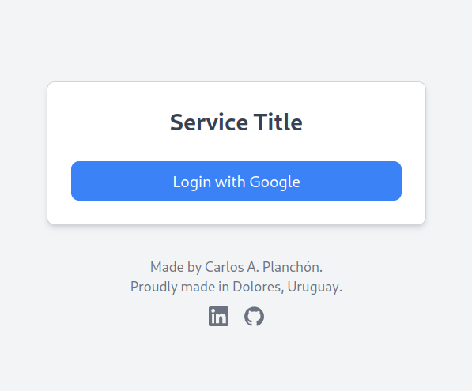
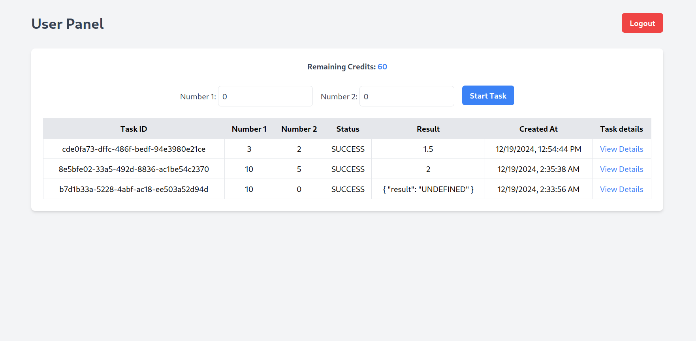

# NanoSaaS

NanoSaaS is a lightweight microservice platform for managing and tracking computational tasks. Designed with simplicity and scalability in mind, NanoSaaS is perfect for developers and small teams looking to automate background processes efficiently.

I built this system in just three days with almost no prior knowledge of web design or frontend development. While it works, the code quality might not adhere to the best practices, especially in terms of maintainability and structure. I encourage you to check the GitHub issues section, where I've documented the limitations and areas for improvement that I'm currently aware of.

---

## Features

- **Task Management**: Run and monitor background tasks using Celery.
- **Real-Time Updates**: Track task statuses and results in real time.
- **Secure Authentication**: Google SSO for easy and secure login.
- **Credits System**: Users are assigned credits to manage task execution, ensuring controlled resource usage.
- **Data Persistence**: PostgreSQL with Tortoise ORM for secure data management.
- **Modern UI**: Responsive frontend with Alpine.js and Tailwind CSS.
- **Scalable Architecture**: Built with FastAPI and Docker-ready.

### DeepWiki Docs: [https://deepwiki.com/carlosplanchon/nanosaas](https://deepwiki.com/carlosplanchon/nanosaas)

---

## Tech Stack

- **Backend**: FastAPI, Celery, Redis
- **Frontend**: Alpine.js, Tailwind CSS
- **Database**: PostgreSQL, Tortoise ORM
- **Authentication**: Google SSO

---

## Installation

1. Clone the repository:
    ```bash
    git clone https://github.com/carlosplanchon/nanosaas.git
    cd nanosaas
    ```

2. Set up the environment:
    ```bash
    pip install -r requirements.txt
    ```

3. Configure the `config.toml` file:
    - Create a `config.toml` file in the root directory based on the provided `config.template.toml`.
    - Fill in the required fields:
        ```toml
        [api]
        # --- Internal Keys --- #
        JWT_SIGNING_SECRET_KEY = "your_secret_key"  # Used to sign JWTs; ensure this is a strong, secret key.

        # --- Third parties keys --- #
        GOOGLE_CLIENT_ID = "your_google_client_id"
        GOOGLE_CLIENT_SECRET = "your_google_client_secret"
        GOOGLE_REDIRECT_URI = "your_redirect_uri"

        [database]
        DB_HOST = "your_db_host"
        DB_PORT = 5432  # Ensure this is an integer.
        DB_NAME = "your_database_name"
        DB_USERNAME = "your_db_username"
        DB_PASSWORD = "your_db_password"

        [celery]
        # Local Redis:
        broker="redis://127.0.0.1:6379/0"
        backend="redis://127.0.0.1:6379/0"
        ```
    - Replace placeholders with your actual values.

4. Run the services:
    - **PostgreSQL**: Make sure PostgreSQL is running and configured.
    - **Redis**: Start Redis (e.g., using Docker: `docker run -p 6379:6379 redis`).

5. Start the backend:
    ```bash
    uvicorn main:app --reload
    ```

6. Start the Celery worker:
    ```bash
    celery -A celery_task.celery worker --loglevel=info
    ```

---

## Usage

1. Access the application at `http://127.0.0.1:8000`.
2. Log in using Google SSO.

   

3. Create and manage tasks via the user dashboard.

   

4. Each user starts with a predefined number of credits (e.g., 5). A credit is deducted for each task executed. If credits run out, the user will need to wait or request more credits.
5. Customize your tasks by modifying the `celery_task.py` file. For example, the included `divide()` function in `celery_task.py` simulates a long-running operation:
    ```python
    @celery_app.task
    def divide(x, y, user_id):
        time.sleep(5)  # Simulate a long-running operation
        if y == 0:
            return {"result": "UNDEFINED"}
        return x / y
    ```
   Replace or extend this function to implement your own task logic.

---

## Development Notes

- To monitor tasks:
    - Use **Flower** for Celery monitoring: `celery -A celery_task.celery flower --port=5555`.
    - Use the Celery TUI monitor: `celery -A celery_task.celery events`.
- Database migrations are managed with **Aerich**.

---

## Contributing

Contributions are welcome! Please fork the repository and submit a pull request. For major changes, please open an issue first to discuss your ideas.

---

## License

This project is licensed under the MIT License. See the `LICENSE` file for details.

---

## Acknowledgments

Built with ❤️ by [Carlos A. Planchón](https://github.com/carlosplanchon) in Dolores, Uruguay.
